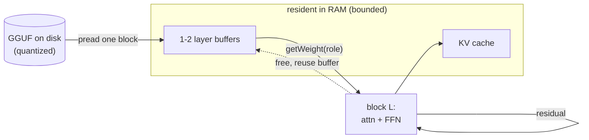

# The streaming layer loader

This is a walkthrough of the one idea that makes sipllm interesting: **a model
many times larger than RAM still runs, because only one transformer block is
ever resident at a time.** Peak memory tracks *layer* size, not *model* size.

The relevant code:

| File | Role |
|------|------|
| [`include/llm/weight_source.h`](../include/llm/weight_source.h) | the `WeightSource` interface the loader reads through |
| [`include/llm/loader.h`](../include/llm/loader.h) / [`src/loader.cpp`](../src/loader.cpp) | `LayerLoader` — residency, the ring of buffers, the prefetch worker |
| [`src/transformer.cpp`](../src/transformer.cpp) | the forward pass that drives the loader |
| [`include/llm/quant.h`](../include/llm/quant.h) / [`src/quant.cpp`](../src/quant.cpp) | `matmul_quant`, which dequantizes one weight row at a time |

## The seam: `WeightSource`

The transformer never opens a file. It talks to a `WeightSource`, which exposes
exactly three things:

- a **tensor directory** — for each tensor, its name, dtype, `[n_out, n_in]`
  shape, and byte offset in the file (`tensors()`, `find()`);
- **typed metadata** — the hyperparameters and tokenizer, read by
  `ModelConfig::from_source`;
- **"read this tensor's raw bytes"** — `read_raw()` / `read_raw_at()`, a
  positional `pread` that never loads the whole file.

Both the real GGUF parser (`GgufFile`) and the toy `.llmw` writer implement this
interface, so the entire forward pass is oblivious to *where* bytes come from —
a `pread`, a prefetch buffer, or an `mmap` page. That is what lets the loader
change residency strategy without touching a line of math.

## One forward pass, layer by layer

`Transformer::forward(token, pos)` ([`src/transformer.cpp`](../src/transformer.cpp)):

```
embed_token(token)              -> x   (one row streamed from disk, or resident if tied)
for layer L in 0 .. n_layers-1:
    loadLayer(L)                -> make block L's 9 weights resident (may block on prefetch)
    block(L, pos)               -> RMSNorm -> QKV -> RoPE -> GQA attn -> proj -> RMSNorm -> SwiGLU
    unloadLayer()               -> release block L for reuse
final RMSNorm + output projection -> logits
```

Each block asks the loader for its weights by **role**
(`Role::AttnNorm, AttnQ, AttnK, AttnV, AttnOut, FfnNorm, FfnGate, FfnUp,
FfnDown`), which the loader maps to GGUF tensor names like
`blk.<L>.attn_q.weight`. After the block runs, those weights are free to be
overwritten by a later layer.



## Why peak RSS is flat

Two mechanisms keep only a layer's worth of weights live:

1. **Per-layer residency.** `loadLayer(L)` reads block `L`'s tensors into a
   buffer; `unloadLayer()` releases it. With the synchronous single-buffer
   loader, exactly one block is resident. A 70B model has ~80 blocks; one block
   of a 4-bit 70B is a few hundred MB, so it fits in a phone's RAM even though
   the file on disk is tens of GB.

2. **Weights stay quantized; dequant is per-row.** In `Residency::Quantized`
   the loader keeps each weight's raw on-disk bytes resident and never bulk-
   expands them to fp32. `matmul_quant` ([`src/quant.cpp`](../src/quant.cpp))
   walks one output row, dequantizes *that row's* blocks into a tiny scratch
   buffer, dots it with the activation, and moves on:

   ```
   for each output row o:
       dequantize_row(type, W + o*row_bytes, scratch[n_in])   // one row only
       y[o] = dot(scratch, x)
   ```

   So a whole layer stays quantized in RAM (~4 bits/weight) instead of fp32
   (32 bits/weight) — an 8x saving on the dominant cost.

`Residency::FP32` is the simpler alternative (dequantize each weight on load);
it uses more RAM and exists mainly for the numeric-equivalence tests. Norm
weights are tiny and always kept fp32.

## The async double-buffer prefetch

Reading a block from storage and dequantizing it can overlap with computing the
previous block. `LayerLoader` runs an optional background worker and a small
ring of buffers (`Options::n_buffers`, default 2):

```
        compute thread                 prefetch worker (background)
        --------------                 ----------------------------
  loadLayer(L)  --------- enqueue L+1 -----> pread block L+1
  block(L) runs attention+FFN                dequant / stage into other buffer
  loadLayer(L+1) --------- already Ready? --> HIT  (no wait)
                          not finished? ----> MISS (block until ready)
```

The three stages are **Storage (`pread`) → Dequant → ready buffer**. While the
compute thread runs block `L`, the worker is already materializing block `L+1`
into the *other* buffer. When compute finishes and calls `loadLayer(L+1)`, the
block is usually already `Ready` — a *prefetch hit* — so the compute thread
never waits on I/O. If the worker has not finished (a *miss*), `loadLayer`
blocks until it does. The `Stats` counters (`prefetch_hits` /
`prefetch_misses`) expose how well the pipeline is keeping up; the profiler
(`build/bench`) prints per-layer I/O, dequant, compute, and RSS.

An `mmap` backend is also available (`Options::use_mmap`): tensor bytes are read
straight from mapped pages instead of `pread`, letting the OS page cache do the
buffering. All three modes (sync single-buffer, async double-buffer, mmap) are
switchable and benchmarked side by side, and all produce identical output —
because, again, the math only ever sees a `WeightSource`.
